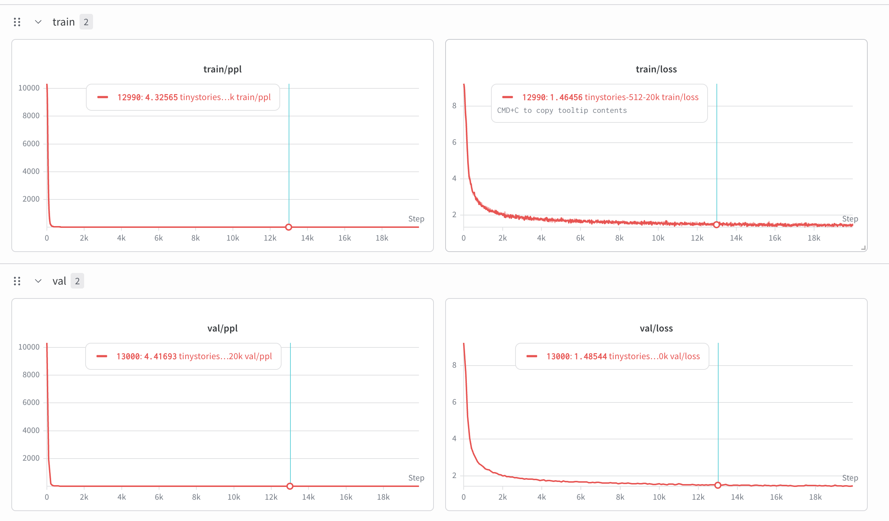

# CS336 Spring 2025 Assignment 1: Basics

For a full description of the assignment, see the assignment handout at
[cs336_assignment1_basics.pdf](./cs336_assignment1_basics.pdf)

If you see any issues with the assignment handout or code, please feel free to
raise a GitHub issue or open a pull request with a fix.

## Setup

### Environment
We manage our environments with `uv` to ensure reproducibility, portability, and ease of use.
Install `uv` [here](https://github.com/astral-sh/uv#installation) (recommended), or run `pip install uv`/`brew install uv`.
We recommend reading a bit about managing projects in `uv` [here](https://docs.astral.sh/uv/guides/projects/#managing-dependencies) (you will not regret it!).

You can now run any code in the repo using
```sh
uv run <python_file_path>
```
and the environment will be automatically solved and activated when necessary.

### Run unit tests


```sh
uv run pytest
```

Initially, all tests should fail with `NotImplementedError`s.
To connect your implementation to the tests, complete the
functions in [./tests/adapters.py](./tests/adapters.py).

### Download data
Download the TinyStories data and a subsample of OpenWebText

``` sh
mkdir -p data
cd data

wget https://huggingface.co/datasets/roneneldan/TinyStories/resolve/main/TinyStoriesV2-GPT4-train.txt
wget https://huggingface.co/datasets/roneneldan/TinyStories/resolve/main/TinyStoriesV2-GPT4-valid.txt

wget https://huggingface.co/datasets/stanford-cs336/owt-sample/resolve/main/owt_train.txt.gz
gunzip owt_train.txt.gz
wget https://huggingface.co/datasets/stanford-cs336/owt-sample/resolve/main/owt_valid.txt.gz
gunzip owt_valid.txt.gz

cd ..
```

## results
### generated text
```
>   --checkpoint checkpoints/ckpt_19500.pt \
>   --prompt "Once upon a time, there was a little rabbit" \
>   --max-tokens 150 \
>   --temperature 0.8 \
>   --top-p 0.9 \
>   --device cuda
Loaded checkpoint from step 19500
Once upon a time, there was a little rabbit. The rabbit was very sorry because he did not have any friends. He was always scared and would often cry.
One day, the rabbit went to a big field. In the field, he saw a squirrel. The squirrel was eating some oats. The rabbit wanted to play with the squirrel. So, the rabbit ran up to the squirrel and said, "Hi, squirrel! Do you want to play with me?"
The squirrel was surprised and happy. He said, "Yes, I want to play with you!" They played all day in the field. The rabbit learned to be more careful with oats. The squirrel and the squirrel became good friends. They played together every day and had lots of fun.
```
### train log


