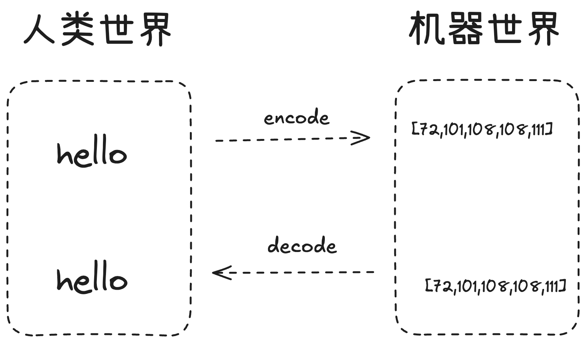
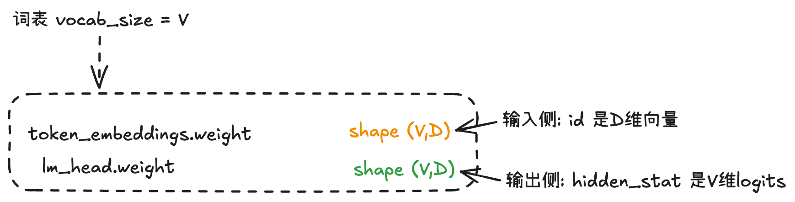
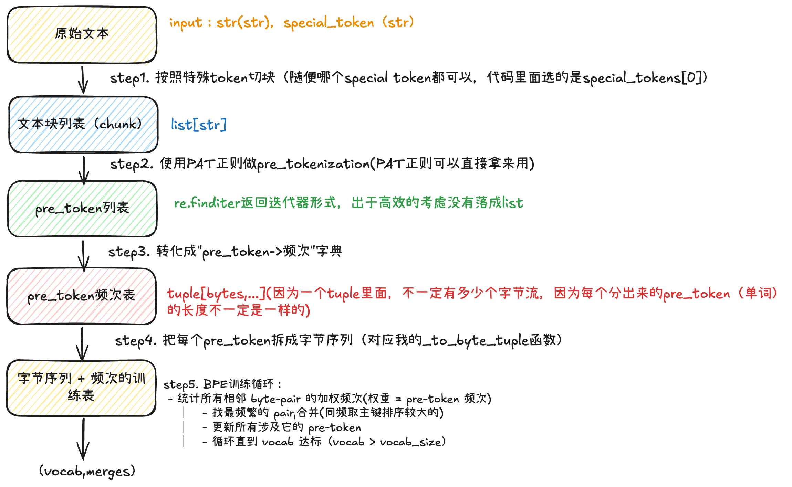

# CS336 Assignment 1: 学习笔记

## 目录

- [推荐的实现顺序](#推荐的实现顺序)
- **Part 1: BPE 训练**
  - [1.1 BPE 是什么](#11-bpe-是什么)
  - [1.2 Byte-level BPE vs 经典 BPE](#12-byte-level-bpe-vs-经典-bpe)
  - [1.3 词表(Vocabulary)](#13-词表vocabulary)
  - [1.4 Pre-tokenization](#14-pre-tokenization)
  - [1.5 单轮 BPE 训练的输入输出](#15-单轮-bpe-训练的输入输出)
  - [1.6 pre-token 的数据表示:`tuple[bytes, ...]`](#16-pre-token-的数据表示)
  - [1.7 训练性能优化:增量更新](#17-训练性能优化增量更新)
- **Part 2: Tokenizer 编解码**
  - [2.1 Tokenizer 类的三个反向索引](#21-tokenizer-类的三个反向索引)
  - [2.2 encode 算法](#22-encode-算法)
  - [2.3 decode 算法](#23-decode-算法)
  - [2.4 encode_iterable:流式编码](#24-encode_iterable流式编码)

---

## 推荐的实现顺序

handout 也是按这个顺序组织的,有清晰的依赖关系:

1. **BPE 训练** (`test_train_bpe.py`) → 先有词表
2. **BPE Tokenizer** (`test_tokenizer.py`) → 能编解码文本
3. **基础层** → Linear / Embedding / RMSNorm / SiLU / SwiGLU / Softmax (`test_model.py` 前几个)
4. **注意力** → SDPA → MHA → RoPE → MHA+RoPE
5. **TransformerBlock → TransformerLM**(端到端)
6. **训练工具** → cross_entropy / AdamW / LR schedule / gradient clipping (`test_nn_utils.py`, `test_optimizer.py`)
7. **数据采样 + checkpoint** (`test_data.py`, `test_serialization.py`)
8. **真正训练**:TinyStories 跑通,可选上 OpenWebText 冲 leaderboard

---

# Part 1: BPE 训练

注意 `tests/adapters.py` 里的类型签名:

```python
vocab:
    The trained tokenizer vocabulary, a mapping from int (token ID in the vocabulary)
    to bytes (token bytes)
```

是 `bytes` 而不是 `str` —— **byte-level BPE 的核心标志**。

---

## 1.1 BPE 是什么

BPE = **Byte Pair Encoding**(字节对编码),可以看作一种数据压缩算法。

**灵魂思想**:

> *"在数据里反复出现的字节对,把它们合并成一个新符号。"*

**词表是"成品",BPE 是"造词表的算法"**。BPE 同时产出两个东西:
- **vocab**:`dict[int, bytes]`,id 到字节串的映射
- **merges**:`list[tuple[bytes, bytes]]`,按学习顺序排列的合并规则

这两个配套使用,共同定义了"怎么把文本切成 token"。

---

## 1.2 Byte-level BPE vs 经典 BPE

| 维度 | 经典 BPE(早期 NMT) | Byte-level BPE(现代) |
|---|---|---|
| **初始 vocab** | Unicode 字符(几万个) | 256 个字节(固定) |
| **处理新字符** | 切不动,要 fallback 到 `<unk>` | 不可能 OOV |
| **多语言支持** | 中文/日文要专门预处理 | 天然支持 |
| **词表大小** | 跟语种数量相关 | 完全可控 |

这就是为什么 **GPT-2 / GPT-3 / GPT-4 / LLaMA / Qwen 都没有 `<unk>` token** —— byte-level BPE 不可能产生未知 token,最坏情况就是把一个稀有字符拆成 1~4 个字节。

---

## 1.3 词表(Vocabulary)

### 作用:**整数 ↔ 字节** 的双向映射

模型只认数字。词表把 **人类世界的字节序列** 翻译成 **模型世界的整数 ID**(以及反过来):


词表本质是 `dict[int, bytes]`:

```python
{
  0: b'\x00',
  ...
  255: b'\xff',                # 前 256 个 = 全部字节
  256: b'<|endoftext|>',       # 特殊 token
  257: b' th',                 # BPE 学出来的合并
  258: b' the',
  ...
}
```

- **token id** = 整数
- **token** = 一串字节(**不一定是合法 UTF-8**,可能是字符片段)

### 为什么从 256 个字节开始?

> Since we're training a byte-level BPE tokenizer, our initial vocabulary is simply the set of all bytes. There are 256 possible byte values.

256 = 一个字节 8 位 = `2^8`。

**这是 byte-level BPE 永远不会 OOV 的根本保证**:

```
任何文本 → UTF-8 编码 → 任何字节序列(0~255) → 初始词表里全有
       → BPE merge → 逐步合并成更长的 token
```

最坏情况:某个稀有字节序列没被合并,以 1~4 个 byte token 形式出现。**没有切不出来的情况**。

对比字符级:初始词表要装下 ~15 万个 Unicode 字符,且新字符 `<unk>`。Byte-level 用 256 这个最小初始词表,换来"覆盖宇宙中所有可能文本"的能力。

### 词表跟模型其他组件的耦合

词表大小 `V` 直接决定两个张量的形状:


- 词表多大,embedding 矩阵就有多大
- 词表多大,模型最后 softmax 的目标类别就有多少
- **词表里少一个 token,模型就永远学不会输出它**

`run_transformer_lm` 的第一个参数就是 `vocab_size`:

```279:289:assignment1-basics/tests/adapters.py
def run_transformer_lm(
    vocab_size: int,
    context_length: int,
    d_model: int,
    num_layers: int,
    num_heads: int,
    d_ff: int,
    rope_theta: float,
    weights: dict[str, Tensor],
    in_indices: Int[Tensor, " batch_size sequence_length"],
) -> Float[Tensor, " batch_size sequence_length vocab_size"]:
```

返回类型最后一维就是 `vocab_size` —— **"对每个词表里的 token,预测它作为下一个 token 的得分"**。

### 词表在完整流程里出现 3 次

```
                  ┌────────────────────┐
原始文本           │  "Hello, 你好"      │
                  └─────────┬──────────┘
                            │ UTF-8 编码
                            ▼
                  ┌──────────────────────────────────────┐
字节序列           │ b'Hello, \xe4\xbd\xa0\xe5\xa5\xbd'  │
                  └─────────┬────────────────────────────┘
                            │ ① tokenizer.encode(查词表 + apply merges)
                            ▼
token id 序列        [13225, 11, 220, 16, 17, 9909]
                            │ ② token_embeddings[id](词表大小决定行数)
                            ▼
向量序列              shape: (seq_len, d_model)
                            │ Transformer 层...
                            ▼
hidden states         shape: (seq_len, d_model)
                            │ lm_head (Linear D→V,词表大小决定输出维度)
                            ▼
logits                shape: (seq_len, vocab_size)
                            │ softmax + sample
                            ▼
预测 id               [4567]
                            │ ③ 查词表 vocab[4567]
                            ▼
预测字节              b' world'
                            │ UTF-8 解码
                            ▼
                       " world"
```

**3 个位置**:① encode 时切 id;② embedding 时查向量;③ decode 时翻译回字节。

### 词表大小的工程权衡

| 维度 | 词表小 | 词表大 |
|---|---|---|
| embedding / lm_head 显存 | 小 | 大(`V × D`) |
| 每个序列的 token 数 | **多**(同一句话切得更碎) | **少** |
| 训练 FLOPs | attention 多 | embedding 大但 attention 少 |
| 多语言公平性 | 小语种被切得很碎 | 可为小语种分 token |
| 学习难度 | 高频,易学 | 长尾难学 |

主流 LLM 的实际选择(2025):

```
GPT-2:        50k    (英语为主)
LLaMA-1:      32k
LLaMA-3:     128k    (多语言)
Qwen2.5:     152k    (强化中文)
GPT-4o:      200k
Gemini 2:    256k
```

**趋势是越来越大**,因为大词表 → 同样 token 数能塞更多内容 → 上下文利用率高 → 训练/推理 FLOPs 节省。

---

## 1.4 Pre-tokenization

### 解决什么问题

直觉做法:"直接统计相邻字节对频次,选最高的合并,循环"。两个致命问题:

**问题 ①:计算太慢**
每合并一次都要扫整个语料(几十 GB)。目标 vocab=32000 → ~31744 次合并 → 几十 GB × 31744 = 不可行。

**问题 ②:标点污染语义**
直接 BPE 会把标点和单词粘在一起学:

```
原文: "I love dogs. My dog! That dog?"
学出来: b'dog.', b'dog!', b'dog?', b'dogs', b'dog '   ← dog 被切成 5 个不同的 token
```

`dog` 这个核心语义被分散到 5 个 id,词表名额浪费,模型难以发现这些是同一个词。

### 解决方案:**粗粒度切分(pre-tokenization)**

BPE 训练前,先把文本用正则切成"粗块"(pre-tokens),**BPE 只能在每个粗块内部合并,不能跨边界**:

```
原始: "I love dogs. My dog!"
切成: ['I', ' love', ' dogs', '.', ' My', ' dog', '!']
       │       │              │              │
       │       │              │              └── '!' 自成一块
       │       │              └── '.' 自成一块
       │       └── ' love' / ' dogs' / ' My' / ' dog' 内部可合并
       └── 'I' 自成一块
```

- ✅ `dog` 在不同句子里都被切成同一个 token,语义统一
- ✅ 标点独立,不污染单词
- ✅ 计算量大幅下降(见下)

### 为什么也大幅加速训练

**关键观察**:很多粗块在语料里重复出现非常多次。`the` 在英文语料可能出现几百万次。

- **朴素做法**:展开整个语料统计 pair → 几十 GB
- **聪明做法**:**把粗块的"出现次数"当作权重**

```
pre-token 频次表:
  ' the':  3,200,000 次
  ' a':    1,800,000 次
  ' of':   1,500,000 次
  ...
```

统计 byte-pair 频次时只需遍历这张紧凑表:对每个 pre-token 看它内部的相邻 pair,把它的出现次数加到这些 pair 上。

> handout 原话:For example, the word 'text' might be a pre-token that appears 10 times. We can increment their count by **10 instead of looking through the corpus**.

**几十 GB 语料 → 几百万条频次记录**,加速比通常是 **几千倍**。

### GPT-2 正则拆解

```python
PAT = r"""'(?:[sdmt]|ll|ve|re)| ?\p{L}+| ?\p{N}+| ?[^\s\p{L}\p{N}]+|\s+(?!\S)|\s+"""
```

5 个分支用 `|` 串起来:

| 分支 | 模式 | 含义 | 例子 |
|---|---|---|---|
| 1 | `'(?:[sdmt]\|ll\|ve\|re)` | 英文缩写后缀 | `"don't"` → `['don', "'t"]` |
| 2 | ` ?\p{L}+` | 字母序列(可带前导空格) | `" hello"` → `[' hello']` |
| 3 | ` ?\p{N}+` | 数字序列(可带前导空格) | `" 100"` → `[' 100']` |
| 4 | ` ?[^\s\p{L}\p{N}]+` | 标点 / 符号 | `"!!!"` → `['!!!']` |
| 5 | `\s+(?!\S)` + `\s+` | 行末空白 + 其他多余空白 | `"a   b"` → `['a', '  ', ' b']` |

**为什么空格要跟着单词?**
英文里 `"the"`(开头)和 `" the"`(句中)是不同位置的同一个词。带空格的 pre-token 让 BPE 自然学出 `' the'` 这种高频 token。

**为什么标点独立?**
分支 4 直接解决 `dog!` / `dog.` 的问题 —— 标点永远不跟单词粘。

**综合演示**:

```python
import regex as re
PAT = r"""'(?:[sdmt]|ll|ve|re)| ?\p{L}+| ?\p{N}+| ?[^\s\p{L}\p{N}]+|\s+(?!\S)|\s+"""
re.findall(PAT, "some text that i'll pre-tokenize")
# ['some', ' text', ' that', ' i', "'ll", ' pre', '-', 'tokenize']
```

### `re.findall` vs `re.finditer`

> When using it in your code, however, you should use re.finditer to avoid storing the pre-tokenized words

工程建议:
- `re.findall(PAT, text)` → 返回 list,几十 GB 文本 → list 几十 GB → **内存爆**
- `re.finditer(PAT, text)` → 返回迭代器,流式产出 → 不需要同时持有所有 pre-token

```python
counts = Counter()
for match in re.finditer(PAT, text):
    counts[match.group()] += 1
```

### 完整 BPE 训练流程


### Pre-tokenization 是合并的天花板

**BPE 永远不可能学出一个跨越 pre-token 边界的 token**。

对 `"hello world"`,切成 `['hello', ' world']`,**`'o w'` 永远不会被合并** —— 因为 `'o'`(在 `hello` 末尾)和 `' '`(在 `world` 开头)从来不在同一个 pre-token 内,统计相邻 pair 时根本不被算。

这意味着:
- ✅ pre-tokenization 给了 BPE 一个"理性的工作范围"
- ⚠️ **pre-tokenization 的设计直接决定了 tokenizer 的上限** —— 切错了 BPE 也没法纠正

所以:
1. GPT-2 的正则被各家(GPT-3、LLaMA、Claude、Qwen)沿用并微调
2. **不同 tokenizer 的最大差异往往不在 BPE 算法,而在 pre-tokenization 正则**

---

## 1.5 单轮 BPE 训练的输入输出

把每一步的输入输出、变量类型、形状摊开。用 handout 玩具例子(`low/lower/widest/newest`)走一遍。

### 训练的"状态变量"先列清楚

整个 `train_bpe` 函数维护这些状态:

| 变量 | 类型 | 含义 | 何时建 / 改 |
|---|---|---|---|
| `pre_token_freq` | `dict[tuple[bytes, ...], int]` | pre-token → 出现次数 | Step 3 建,Step 5 每轮改 |
| `vocab` | `dict[int, bytes]` | token id → token bytes | 初始 256+special,每轮 +1 |
| `merges` | `list[tuple[bytes, bytes]]` | 已学到的合并规则,**按学习顺序** | 每轮 append 1 个 |
| `pair_freq`(优化版) | `Counter[(bytes, bytes), int]` | pair → 加权频次 | Step 5.1 建,Step 5.4 增量改 |

### 各步骤的输入 / 输出 / 形状

#### Step 1:特殊 token 切块

- **输入**:`input_path: str`(几十 GB),`special_tokens: list[str]`
- **做的事**:按 `<|endoftext|>` 切块,**保证 BPE 不跨边界**
- **输出**:`list[str]` —— 每段是 special token 之间的文本(special token 本身丢掉)

```
输入: "low low<|endoftext|>widest newest"
输出: ["low low", "widest newest"]
```

#### Step 2:pre-tokenization

- **输入**:`list[str]`(上一步的 chunks)
- **做的事**:对每块用 GPT-2 `PAT` 正则 `re.finditer` **流式**切 pre-tokens
- **输出**:**`str` 迭代器**(不落地,省内存)

```
输入: "low low low lower lower widest..."
输出 (流): "low", " low", " low", ..., " lower", " widest", ...
```

#### Step 3 + 4:**str → tuple[bytes,...] + 频次表**

代码里这两步一气呵成:

```python
for m in re.finditer(PAT, sub_chunk):
    pre_token_freq[_to_byte_tuple(m.group())] += 1
```

- **输入**:Step 2 的 `str` 流
- **做的事**:
  1. 每个 `str` 经 `_to_byte_tuple` 转成 `tuple[bytes, ...]`,每个元素是**单字节 bytes**
  2. 用 dict 累加频次
- **输出**:`pre_token_freq: dict[tuple[bytes, ...], int]`

handout 玩具例子最终长这样:

```python
pre_token_freq = {
    (b'l', b'o', b'w'):                            5,
    (b'l', b'o', b'w', b'e', b'r'):                2,
    (b'w', b'i', b'd', b'e', b's', b't'):          3,
    (b'n', b'e', b'w', b'e', b's', b't'):          6,
}
```

**形状感觉**:
- dict 大小:几百万条(真实语料)
- 每个 key 是一个 tuple,长度 = pre-token 的字节数
- 每个 value 是 int

### Step 5:**BPE 训练主循环**

进入主循环前,先初始化:

```python
vocab = {i: bytes([i]) for i in range(256)}       # 0~255 → b'\x00'~b'\xff'
for k, st in enumerate(special_tokens):
    vocab[256 + k] = st.encode("utf-8")            # 256 → b'<|endoftext|>'
merges = []
# 此时 len(vocab) = 257
```

然后循环:

```python
while len(vocab) < vocab_size:
    ...
```

每一轮做 **4 件事**:

#### 5.1 统计相邻 pair 加权频次

- **输入**:`pre_token_freq`
- **做的事**:遍历每个 pre-token,看相邻 pair,按 pre-token 频次累加
- **输出**:`pair_freq: Counter[(bytes, bytes), int]`

handout 玩具 Round 1 初始状态:

```
对 (b'l', b'o', b'w'), freq=5: pair (l,o) += 5, pair (o,w) += 5
对 (b'l', b'o', b'w', b'e', b'r'), freq=2: pair (l,o) += 2, (o,w) += 2, (w,e) += 2, (e,r) += 2
对 (b'w', b'i', b'd', b'e', b's', b't'), freq=3: pair (w,i)+=3, (i,d)+=3, (d,e)+=3, (e,s)+=3, (s,t)+=3
对 (b'n', b'e', b'w', b'e', b's', b't'), freq=6: pair (n,e)+=6, (e,w)+=6, (w,e)+=6, (e,s)+=6, (s,t)+=6

→ pair_freq = {
    (b'l',b'o'): 7,  (b'o',b'w'): 7,
    (b'w',b'e'): 8,  (b'e',b'r'): 2,
    (b'w',b'i'): 3,  (b'i',b'd'): 3, (b'd',b'e'): 3,
    (b'e',b's'): 9,  (b's',b't'): 9,
    (b'n',b'e'): 6,  (b'e',b'w'): 6,
}
```

#### 5.2 找最频繁的 pair(同频取 lex 较大)

- **输入**:`pair_freq`
- **做的事**:`max(pair_freq.items(), key=lambda kv: (kv[1], kv[0]))`
  - 主排序键:频次(大的赢)
  - 次排序键:pair 本身的 bytes(大的赢,lex 比较)
- **输出**:`best_pair: tuple[bytes, bytes]`

```
最高频次是 9:(b'e', b's') 和 (b's', b't') 平手
lex 比较: (b'e', b's') < (b's', b't')   ← 因为 b'e' < b's'
取较大的 → best_pair = (b's', b't')
```

#### 5.3 更新 vocab 和 merges

- **输入**:`best_pair`
- **做的事**:
  ```python
  new_token = best_pair[0] + best_pair[1]    # bytes 拼接:b's' + b't' = b'st'
  vocab[len(vocab)] = new_token              # 257 → b'st'
  merges.append(best_pair)                   # [(b's', b't')]
  ```
- **输出**:`vocab` 大小 +1,`merges` 长度 +1

#### 5.4 把 best_pair 在所有 pre-token 里合并

- **输入**:`pre_token_freq`, `best_pair=(b's', b't')`
- **做的事**:扫所有 pre-token,把相邻的 `(b's', b't')` 替换成 `b'st'`(**1 个 2 字节元素**)
- **输出**:`pre_token_freq` 更新

```
合并前:
  (b'l', b'o', b'w'):                     5     ← 没 (s,t),不动
  (b'l', b'o', b'w', b'e', b'r'):         2     ← 没 (s,t),不动
  (b'w', b'i', b'd', b'e', b's', b't'):   3     ← 有!
  (b'n', b'e', b'w', b'e', b's', b't'):   6     ← 有!

合并后:
  (b'l', b'o', b'w'):                     5
  (b'l', b'o', b'w', b'e', b'r'):         2
  (b'w', b'i', b'd', b'e', b'st'):        3     ← 元素从 6 个变 5 个
  (b'n', b'e', b'w', b'e', b'st'):        6
```

**关键变化**:tuple 里的元素不再都是单字节。`b'st'` 是 2 字节的 bytes,每个元素仍然是 "**当前 vocab 里的某个 token**"。

### "vocab 达标"是什么意思

`vocab_size` 是 `train_bpe` 的 **目标参数**:

| 场景 | vocab_size |
|---|---|
| 课程小测试(corpus.en) | 500 |
| TinyStories 实战 | 10,000 |
| OpenWebText 实战 | 32,000 |
| GPT-2 生产 | ~50,257 |

主循环用这个判断:

```python
while len(vocab) < vocab_size:    # ← "vocab 达标" 判断
    ...
```

**"vocab 达标" = `len(vocab) == vocab_size`**,while 条件不成立,退出。

**要做多少轮?** 每轮 vocab +1。初始大小 = `256 + len(special_tokens)`:

```
轮数 = vocab_size - 256 - len(special_tokens)
```

- `vocab_size=500`,1 个 special → 做 `500 - 256 - 1 = 243` 轮
- `vocab_size=10000`,1 个 special → 做 `9743` 轮

**特殊情况:`pair_freq` 为空**

```python
if not pair_freq:
    break
```

当所有 pre-token 都被合并成 1 个元素了(`len(pre_token) == 1`),就没有相邻 pair。语料太小或太单一时会触发,vocab 没达标也提前退出。

---

## 1.6 pre-token 的数据表示

数据结构是 `dict[tuple[bytes, ...], int]`,把每个独立 pre-token 用一个 `tuple` 存。这个设计是 BPE 实现的核心。

### tuple 代表一个 pre-token

```
"low"     →  (b'l', b'o', b'w')          freq=5
" low"    →  (b' ', b'l', b'o', b'w')    freq=10
" cat"    →  (b' ', b'c', b'a', b't')    freq=3
```

每个元素都是一个 `bytes` 对象(因为 Python 没有"单字节"类型,`b'l'` 是 `bytes`,不是 `char`)。

### tuple 边界 = BPE 合并的边界

`" low"` 的 `b'w'` 和 `" cat"` 的 `b' '` 永远不会被合并,因为它们在两个 **不同的 tuple** 里。**tuple 边界就是合并边界**。

### tuple 元素长度会随 BPE 进行而变化

一开始每个元素 1 字节:

```
(b'l', b'o', b'w')       ← Round 0,3 个元素,每个 1 字节
```

合并 `(b'l', b'o')` → `b'lo'`:

```
(b'lo', b'w')            ← Round 1,2 个元素,第一个 2 字节
```

再合并 `(b'lo', b'w')` → `b'low'`:

```
(b'low',)                ← Round 2,1 个元素,3 字节
```

每个元素 **是一个"当前 vocab 里的 token"**。Round 越往后,元素越少、每个越长。

### Python 字节操作的两个坑

1. **`bytes` 索引返回 `int`,切片才返回 `bytes`**:
   ```python
   b'low'[0]      # → 108 (int!)
   b'low'[0:1]    # → b'l' (bytes)
   ```
   `_to_byte_tuple` 必须用切片 `b[i:i+1]`,不能用 `b[i]`。

2. **`tuple` 不可变,合并时要用 `list`**:
   增量更新时要就地修改(`parts[p:p+2] = [...]`),只有 `list` 支持。

---

## 1.7 训练性能优化:增量更新

### 问题:朴素 BPE 主循环 O(num_merges × N)

每轮主循环里:
```python
pair_freq = _count_pairs(pre_token_freq)   # 扫所有 pre_token
best_pair = max(pair_freq.items(), key=...)
pre_token_freq = _apply_merge(...)         # 再扫一遍所有 pre_token
```

测试 corpus.en(几 MB):**总耗时 3.4 秒,其中主循环占 98.4%**(pre-tokenization 只占 1.6%)。

handout 说"the merging part of BPE training is **not parallelizable in Python**" —— 主循环不能用 multiprocessing 救,只能从算法层面优化。

### 核心想法

> handout 原话:the only pair counts that change after each merge are those that **overlap with the merged pair**. Thus, BPE training speed can be improved by **indexing the counts of all pairs and incrementally updating these counts**.

每次合并 `(A, B)` 时,**全语料只有少数几个 pre-token 包含 `(A, B)`**。只更新这些,不要重扫所有。

### 数据结构(4 件套)

```python
pre_tokens: list[list[bytes]]              # pre-token 用 list 存(可变,支持就地修改)
pre_token_count: list[int]                 # 每个 pre-token 的频次

pair_freq: Counter[(bytes, bytes), int]    # 全局 pair 频次(只在 _init_indices 里建一次,之后增量维护)

pair_to_pretokens: dict[(bytes, bytes), set[int]]   # 反向索引:每个 pair 出现在哪些 pre-token(存索引)
```

**反向索引是关键**。比如 `pair_to_pretokens[(b'e', b's')] = {2, 3}` 意味着合并 `(e, s)` 时只看 pre-token 2 和 3,**跳过其他几千个**。

### 主循环

```python
pre_tokens, pre_token_count, pair_freq, pair_to_pretokens = _init_indices(pre_token_freq)

while len(vocab) < vocab_size:
    if not pair_freq:
        break
    best_pair = max(pair_freq.items(), key=lambda kv: (kv[1], kv[0]))[0]
    vocab[len(vocab)] = best_pair[0] + best_pair[1]
    merges.append(best_pair)
    _apply_merge_incremental(best_pair, pre_tokens, pre_token_count, pair_freq, pair_to_pretokens)
```

### `_apply_merge_incremental` 的核心:**diff 多重集**

对每个受影响的 pre-token:

1. 数旧 pre-token 里所有 pair 的多重集(`Counter`)
2. 就地合并 `(A, B)` → `new_token`
3. 数新 pre-token 里所有 pair 的多重集
4. **diff 更新**:对所有涉及的 pair,计算 `delta = new_count - old_count`,然后:
   - `pair_freq[p] += delta * freq`
   - 维护 `pair_to_pretokens`(set 加 / discard)

**为什么用 Counter 不用 set?**
`[A, B, A, B]` 这种 pre-token 含 `(A, B)` 两次,合并后是 `[AB, AB]`,含 `(AB, AB)` 一次。用 set 会丢重数,频次算错。

**为什么 diff 而不是分别加减?**
两者等价,diff 更优雅,自动跳过零变化的 pair。

**`Counter` 减法的坑**:
```python
Counter({'a': 1}) - Counter({'a': 2})   # → Counter({})  负数被丢!
```
不能直接用 `-`,要手动循环算 `delta = new_pairs.get(p, 0) - old_pairs.get(p, 0)`。

### 性能结果

| 实现 | corpus.en (500 vocab) |
|---|---|
| 朴素(每轮 `_count_pairs`) | 3.4 秒(98.4% 在主循环) |
| 增量更新 | **0.36 秒**(**比参考实现 0.38s 还快**) |

**~10x 提速**。3/3 测试全过。

### 通用 lesson:profile 优先,别瞎并行

走了弯路:一开始把 `find_chunk_boundaries(f, 4, ...)` 当成"并行加速",其实只是把文件切 4 块再 **串行** 处理。即便真用 `multiprocessing.Pool` 并行,pre-tokenization 只占 1.6%,最多省 0.05 秒,过不了 1.5 秒上限。

**用 `time.time()` 或 `cProfile` 先找瓶颈,再优化**。

---

# Part 2: Tokenizer 编解码

`Tokenizer` 类的职责:用训练好的 `(vocab, merges, special_tokens)` 来 **encode**(文本 → token id)和 **decode**(token id → 文本)。

API:
- `__init__(vocab, merges, special_tokens=None)`
- `encode(text: str) -> list[int]`
- `decode(tokens: list[int]) -> str`
- `encode_iterable(iterable) -> Iterator[int]`(流式,内存友好)

---

## 2.1 Tokenizer 类的三个反向索引

构造时建好,后面 encode 反复用:

```python
self.bytes_to_id: dict[bytes, int] = {b: i for i, b in vocab.items()}
self.merge_rank: dict[tuple[bytes, bytes], int] = {pair: rank for rank, pair in enumerate(merges)}
self.special_tokens_sorted = sorted(self.special_tokens, key=len, reverse=True)
```

| 索引 | 用途 |
|---|---|
| `bytes_to_id` | `encode` 拿到一段 bytes,O(1) 查 ID |
| `merge_rank` | `encode` 判断某个 pair 是不是合法 merge,以及它的优先级(rank 越小越先合) |
| `special_tokens_sorted` | 按长度倒序,**长的优先匹配**,防止 `<|endoftext|><|endoftext|>` 被切成两个单 endoftext |

---

## 2.2 encode 算法

### 三步流程

```
1. special_tokens 切大段
   "Hi<|endoftext|>World"  →  ["Hi", "<|endoftext|>", "World"]

2. 遍历每段:
   - special token:直接查 bytes_to_id 拿 ID
   - 普通段:PAT 正则切 pre-tokens,每个 pre-token 跑 BPE

3. 拼成 list[int] 返回
```

### 第 1 步:special tokens 切大段

```python
if self.special_tokens_sorted:
    special_pat = "(" + "|".join(re.escape(t) for t in self.special_tokens_sorted) + ")"
    segments = re.split(special_pat, text)
else:
    segments = [text]
```

**三个细节**:

1. **`re.escape`**:`<|endoftext|>` 里的 `|` 是正则元字符,必须 escape。
2. **`()` 包正则**:`re.split` 默认会 **丢掉** 匹配项,加 `()` 才会保留:
   ```python
   re.split(r"<\|endoftext\|>", "a<|endoftext|>b")   # ['a', 'b']  ← 丢了
   re.split(r"(<\|endoftext\|>)", "a<|endoftext|>b") # ['a', '<|endoftext|>', 'b']
   ```
3. **长度倒序排序**:不然 `<|endoftext|><|endoftext|>` 会被短的吃掉。

### 第 2 步:遍历 segments

```python
token_ids = []
for seg in segments:
    if not seg:
        continue
    if seg in self.special_tokens:
        token_ids.append(self.bytes_to_id[seg.encode("utf-8")])
    else:
        for m in re.finditer(PAT, seg):
            pre_token_bytes = m.group().encode("utf-8")
            token_ids.extend(self._encode_pretoken(pre_token_bytes))
return token_ids
```

注意 `m.group()` 是 `str`,要 `.encode("utf-8")` 才能进 BPE。

### 第 3 步:`_encode_pretoken`(BPE 核心)

```python
def _encode_pretoken(self, pre_token: bytes) -> list[int]:
    parts = [bytes([b]) for b in pre_token]            # 拆成单字节 list

    while True:
        # 找当前 parts 里 rank 最小的 mergeable pair
        best_rank = float('inf')
        best_pair = None
        for i in range(len(parts) - 1):
            pair = (parts[i], parts[i+1])
            rank = self.merge_rank.get(pair, float('inf'))
            if rank < best_rank:
                best_rank = rank
                best_pair = pair

        if best_pair is None:
            break

        # 一次扫描,合并 parts 里所有相邻 (A, B)
        A, B = best_pair
        new_parts = []
        i = 0
        while i < len(parts):
            if i < len(parts) - 1 and parts[i] == A and parts[i+1] == B:
                new_parts.append(A + B)
                i += 2
            else:
                new_parts.append(parts[i])
                i += 1
        parts = new_parts

    return [self.bytes_to_id[p] for p in parts]
```

**为什么选 rank 最小?**
BPE 训练时按顺序学,**越早学到的 merge,rank 越小,优先级越高**。编码时必须复现这个顺序,否则会破坏依赖链(后学的 token 依赖于先学的 token 先被合并好)。

**为什么一次扫描合并所有出现?**
效率。`[A, B, A, B, A, B]` 一次合并完,不要循环 3 次。

**为什么不会死循环?**
每轮 `len(parts)` 至少减 1。最坏到 `len(parts) == 1`,自动退出。

---

## 2.3 decode 算法

```python
def decode(self, tokens: list[int]) -> str:
    return b''.join(self.vocab[t] for t in tokens).decode("utf-8", errors="replace")
```

一行。**关键设计**:

### 必须 **先拼 bytes 再 decode**,不能每个 token 单独 decode

一个 UTF-8 字符可能跨多个 token。比如 🙃 是 4 字节 `\xf0\x9f\x99\x83`,如果被 BPE 切成 2 个 token `\xf0\x9f` 和 `\x99\x83`,**单独 decode 任何一个都是非法 UTF-8**。

错误写法:
```python
''.join(self.vocab[t].decode("utf-8") for t in tokens)   # ❌ 跨字符的 token 会 UnicodeDecodeError
```

正确:**先拼成完整 bytes,再整体 decode**。

### `errors="replace"` vs `"ignore"`

- `"replace"`:遇到非法字节变 `U+FFFD`(乱码占位符)
- `"ignore"`:**静默吞掉**

用 `"replace"`,debug 时能看到出问题的位置。

### `b''.join` vs `''.join`

```python
b''.join([b'a', b'b'])   # → b'ab'  ✓ 拼字节
''.join([b'a', b'b'])    # → TypeError  ✗
bytes([b'a', b'b'])      # → TypeError(把 list 当 list[int]) ✗
```

只有 `b''.join` 是对的。

---

## 2.4 encode_iterable:流式编码

测试要求 **内存只能 1MB**,不能一次读整个文件。

```python
def encode_iterable(self, iterable):
    for line in iterable:
        for tid in self.encode(line):
            yield tid
```

3 行。**原理**:文件对象迭代时每次只读一行,内存只占一行。`yield` 让调用方按需消费,不积累 list。

调用方:

```python
with open("big_file.txt") as f:
    for tid in tokenizer.encode_iterable(f):
        # 一边读一边处理,内存常驻只有一行
        ...
```

---

# 测试通过情况

| 模块 | 测试 | 状态 |
|---|---|---|
| `train_bpe` | 3/3 | ✅ 算法 + 性能优化(3.4s → 0.36s) |
| `Tokenizer` | 24/24 + 1 xfail | ✅ 跟 tiktoken 字节级一致 |

```pythons
============================= test session starts ==============================
platform linux -- Python 3.13.12, pytest-9.0.2, pluggy-1.6.0 -- /data/workspace/llm_course/assignment1-basics/.venv/bin/python
cachedir: .pytest_cache
rootdir: /data/workspace/llm_course/assignment1-basics
configfile: pyproject.toml
plugins: jaxtyping-0.3.9, timeout-2.4.0
collecting ... collected 20 items

tests/test_data.py::test_get_batch PASSED
tests/test_model.py::test_linear PASSED
tests/test_model.py::test_embedding PASSED
tests/test_model.py::test_swiglu PASSED
tests/test_model.py::test_scaled_dot_product_attention PASSED
tests/test_model.py::test_4d_scaled_dot_product_attention PASSED
tests/test_model.py::test_multihead_self_attention PASSED
tests/test_model.py::test_multihead_self_attention_with_rope PASSED
tests/test_model.py::test_transformer_lm PASSED
tests/test_model.py::test_transformer_lm_truncated_input PASSED
tests/test_model.py::test_transformer_block PASSED
tests/test_model.py::test_rmsnorm PASSED
tests/test_model.py::test_rope PASSED
tests/test_model.py::test_silu_matches_pytorch PASSED
tests/test_nn_utils.py::test_softmax_matches_pytorch PASSED
tests/test_nn_utils.py::test_cross_entropy PASSED
tests/test_nn_utils.py::test_gradient_clipping PASSED
tests/test_optimizer.py::test_adamw PASSED
tests/test_optimizer.py::test_get_lr_cosine_schedule PASSED
tests/test_serialization.py::test_checkpointing PASSED

=============================== warnings summary ===============================
tests/test_nn_utils.py::test_gradient_clipping
  /data/workspace/llm_course/assignment1-basics/.venv/lib/python3.13/site-packages/torch/autograd/graph.py:869: UserWarning: CUDA initialization: The NVIDIA driver on your system is too old (found version 12020). Please update your GPU driver by downloading and installing a new version from the URL: http://www.nvidia.com/Download/index.aspx Alternatively, go to: https://pytorch.org to install a PyTorch version that has been compiled with your version of the CUDA driver. (Triggered internally at /pytorch/c10/cuda/CUDAFunctions.cpp:119.)
    return Variable._execution_engine.run_backward(  # Calls into the C++ engine to run the backward pass

-- Docs: https://docs.pytest.org/en/stable/how-to/capture-warnings.html
======================== 20 passed, 1 warning in 3.02s =========================
```